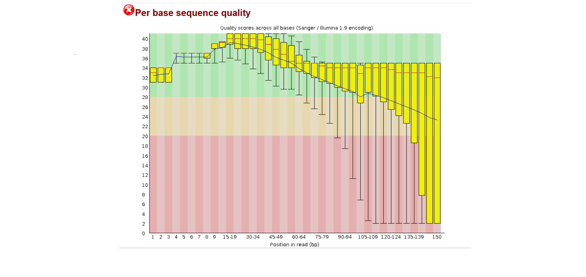

# Variant Calling Pipeline for E. coli Genome Using NGS Data

## Key Results
- 50,000 read pairs (100,000 total reads) were analyzed
- 80,806 reads (80.8%) passed quality filtering after trimming
- 94.26% of reads mapped successfully to the E. coli reference genome
- 91.54% of read pairs were properly paired after alignment
- Base quality (Q30) improved from 81.3% to 87.7% (Read 1) and 71.0% to 84.0% (Read 2) after trimming
- 27,124 total variant sites were identified: 26,989 SNPs and 135 indels
- Transition/transversion (Ts/Tv) ratio: 2.61

## Project Overview
This project implements a complete Next-Generation Sequencing (NGS) variant calling pipeline. It identifies single nucleotide polymorphisms (SNPs) and small insertions/deletions (indels) in an *E. coli* sequencing sample by comparing it against the *E. coli* K-12 MG1655 reference genome. The project was built to demonstrate practical, hands-on NGS analysis skills using standard bioinformatics tools and a real public dataset.

## Biological Question
How does the genome of the sequenced *E. coli* sample differ from the reference *E. coli* K-12 MG1655 genome, and are the detected differences consistent with expected patterns of bacterial genetic variation?

## Dataset
- **Reference genome:** *E. coli* K-12 MG1655, NCBI accession GCF_000005845.2 (~4.6 Mb)
- **Sequencing reads:** SRA accession SRR2584863 (Illumina paired-end reads), subset to the first 50,000 read pairs for fast, reproducible local processing
- **Data source:** NCBI Sequence Read Archive (SRA) and NCBI Genome database

## Tools Used
| Tool | Version | Purpose |
|---|---|---|
| FastQC | 0.12.1 | Raw read quality assessment |
| fastp | 1.3.6 | Read trimming and adapter removal |
| BWA | 0.7.19 | Read alignment to reference genome |
| samtools | 1.23.1 | BAM file sorting, indexing, format conversion |
| bcftools | 1.24 | Variant calling and statistics |
| sra-tools | 3.4.1 | Downloading sequencing data from NCBI SRA |

## Workflow
1. **Quality Control** — FastQC evaluates raw read quality, flagging issues like low base quality or adapter contamination
2. **Trimming** — fastp removes low-quality bases and adapter sequences
3. **Alignment** — BWA-MEM aligns cleaned reads to the reference genome
4. **Sorting & Indexing** — samtools converts SAM to sorted, indexed BAM format
5. **Variant Calling** — bcftools identifies variant positions and generates summary statistics
```
    E. coli NGS Reads
           |
           v
     Quality Control
        (FastQC)
           |
           v
  Adapter/Quality Trimming
        (fastp)
           |
           v
   Reference Alignment
       (BWA-MEM)
           |
           v
    BAM Processing
      (samtools)
           |
           v
     Variant Calling
       (bcftools)
           |
           v
  Variant Statistics
```


## Installation
```bash
git clone https://github.com/hemanshi-malankiya/ngs-projects.git
cd ngs-projects
conda create -n ngs python=3.10 -y
conda activate ngs
conda install -c bioconda -c conda-forge fastqc fastp bwa samtools bcftools sra-tools -y
```

## How to Run
1. Download the reference genome into `ref/`:
```bash
wget -P ref/ https://ftp.ncbi.nlm.nih.gov/genomes/all/GCF/000/005/845/GCF_000005845.2_ASM584v2/GCF_000005845.2_ASM584v2_genomic.fna.gz
gunzip ref/*.fna.gz
```
2. Download sequencing reads into `raw_data/`:
```bash
fastq-dump --split-files -X 50000 SRR2584863 -O raw_data/
```
3. Run each script in order:
```bash
bash scripts/01_qc.sh
bash scripts/02_trim.sh
bash scripts/03_align.sh
bash scripts/04_sort_index.sh
bash scripts/05_call_variants.sh
```

## Results

### Variant Statistics
| Metric | Count |
|---|---|
| Total variant sites | 27,124 |
| SNPs | 26,989 |
| Indels | 135 |
| Multiallelic sites | 1 |
| Transition/Transversion (Ts/Tv) ratio | 2.61 |

The Ts/Tv ratio of 2.61 falls within the expected range for bacterial genomes (typically 2.0-2.5+), indicating the variant calls are biologically credible rather than random noise.

### Read Quality Improvement (fastp trimming)
| Metric | Before Trimming | After Trimming |
|---|---|---|
| Read 1 Q30 bases | 81.3% | 87.7% |
| Read 2 Q30 bases | 71.0% | 84.0% |
| Reads passing filter | - | 80,806 / 100,000 |

Initial FastQC flagged "Per base sequence quality" and "Adapter Content" as failing. After trimming with fastp, base quality improved substantially, confirming the cleaning step was effective before alignment.

### Figures
Full interactive HTML reports are included in the results/ folder. GitHub displays HTML files as raw code by default, so please download and open the files below in a browser to view the complete interactive reports with all graphs.

- [Read 1 FastQC Report](https://htmlpreview.github.io/?https://github.com/hemanshi-malankiya/ngs-projects/blob/main/results/SRR2584863_1_fastqc.html) - full raw read quality report (all graphs: per-base quality, GC content, duplication levels, adapter content, etc.)
- [Read 2 FastQC Report](https://htmlpreview.github.io/?https://github.com/hemanshi-malankiya/ngs-projects/blob/main/results/SRR2584863_2_fastqc.html) - full raw read quality report
- [fastp Trimming Report](https://htmlpreview.github.io/?https://github.com/hemanshi-malankiya/ngs-projects/blob/main/results/fastp.html) - full before/after trimming report (quality curves, filtering summary, adapter trimming details)
- [Full Variant Statistics](results/stats.txt) - complete variant calling statistics

Key quality graph (Per Base Sequence Quality) shown below:



## Limitations
- Analysis used a 50,000-read-pair subset rather than the full sequencing run, to keep processing fast and reproducible on a personal laptop; most genome positions had low read depth (1-5x coverage)
- No variant filtering by quality score or depth was applied beyond bcftools default calling model
- No functional annotation of variants (e.g., which genes are affected) was performed in this version

## Future Work
- Re-run the full, unsubsetted SRR2584863 dataset for higher-confidence, higher-depth variant calls
- Apply quality/depth-based variant filtering
- Annotate variants using SnpEff or ANNOVAR to identify affected genes
- Automate the pipeline using Snakemake or Nextflow
- Extend the analysis to compare multiple E. coli strains

## References
- NCBI Sequence Read Archive: https://www.ncbi.nlm.nih.gov/sra
- NCBI Genome, E. coli K-12 MG1655: https://www.ncbi.nlm.nih.gov/datasets/genome/GCF_000005845.2/
- Li H. (2013). Aligning sequence reads with BWA-MEM. arXiv:1303.3997
- Danecek P. et al. (2021). Twelve years of SAMtools and BCFtools. GigaScience.
- Chen S. et al. (2018). fastp: an ultra-fast all-in-one FASTQ preprocessor. Bioinformatics.

## Author
Hemanshi
